# Questions format to AI
- Provide answer in markdown format the start with ``` and each line inside must start with \``    `\`, each item if not with \``#`\` signs, then must be in bulletin format or sub-bulletin item with '-'

# Diagram Requirements:
- Use **Mermaid code** to represent the diagram.
- Ensure **light colors** for the boxes.
- All text in the boxes should be **bold**.
- Use **large font** for readability.
- The lines connecting the boxes should each have their **own unique color**.
- The boxes should have **bold borders** for emphasis.
- When pasting the code into **app.diagrams.net**, the colors and styles should be retained.
- The arrangement of the boxes should look **balanced both horizontally and vertically** to create a cohesive overall picture.

# Workflow Representation:
- Mark the **order of operations** within the diagram using **numbers in the box labels**.
- Clearly indicate where each operation starts and the sequence of steps.
- For operations that can be executed in parallel, mark them with the **same number**.
- The workflow should be represented by marking box numbers where it starts first.
- For example, **User Interaction and Feedback** should be marked with **#1**.
- The chats and exchanges from the user should be sent back and forth to the operator, which should be marked with **#2**.
- Lines starting from the operator should also be marked with numbers to represent where the next downstream operations take place.
- If operations can be executed in parallel, mark them with the **same number**.


# Enhanced AI Operator Design with User Interface

```mermaid
%%{init: {'themeVariables': {'primaryColor': '#F4F4F4', 'primaryBorderColor': '#333333', 'primaryTextColor': '#000000', 'fontSize': '20px', 'fontFamily': 'Arial', 'lineColor': '#888888', 'edgeLabelBackground':'#FFFFFF'}}}%%
graph TD

    %% Group 1: Knowledge and Data Storage %%
    subgraph group1["<b>Knowledge & Data Storage</b>"]
        C1["<b>#12 Centralized Knowledge Database</b><br/>- Stores interaction threads, metadata"]:::database
        C2["<b>#13 Local Cache in Each Cluster</b><br/>- Local cache of relevant threads<br/>- Reduces latency, updates periodically"]:::database
        C3["<b>#14 Indexes & Optimizations</b><br/>- Full-text search indexes<br/>- Indexes on Context, Keywords, Tags"]:::database
        A5["<b>#5 Knowledge Database & Sync Agent</b><br/>- Synchronizes interaction threads"]:::database
    end

    %% Group 2: Learning & Improvement %%
    subgraph group2["<b>Learning & Improvement</b>"]
        E1["<b>#15 Automated Resolution Learning</b><br/>- Classify & rank threads<br/>- Implement learning loops"]:::feature
        E20["<b>#20 Context-Aware Personalization</b><br/>- Implement user preferences<br/>- Adapt responses based on history"]:::feature
        E10["<b>#24 Continuous Learning & Improvement</b><br/>- Update NLP models & executors"]:::feature
    end

    %% Group 3: Backend Integration & NLP %%
    subgraph group3["<b>Backend Integration & NLP</b>"]
        E21["<b>#21 Integration with External Tools</b><br/>- Extend capabilities with APIs<br/>- Plugin mechanism for external tools"]:::component
        A3["<b>#3 NLP Engine Abstraction Layer</b><br/>- Connects to AI backends<br/>- Translates text into structured commands"]:::component
    end

    %% Group 4: Authentication and RBAC %%
    subgraph auth["<b>Authentication & RBAC</b>"]
        A8["<b>#8 Policy & Authentication Manager</b><br/>- Manages RBAC and permissions"]:::component
        AD["<b>AD Authentication</b><br/>- Authenticates users<br/>- Validates roles and permissions"]:::component
        A22["<b>#22 Data Privacy & Security</b><br/>- Fine-grained access controls<br/>- Support data retention policies"]:::component
    end

    %% Core Components %%
    A1["<b>#1 User Interaction & Feedback</b><br/>- Chat with AI operator<br/>- User rating and feedback"]:::component
    A1_1["<b>1.1 Start Chat</b><br/>- Initiate Interaction"]:::interaction
    A2["<b>#2 AI Operator Controller</b><br/>- Manages CRs with human-readable text<br/>- Orchestrates operations and sequences"]:::component
    A4["<b>#4 Action Executor Modules</b><br/>- Executes specific operations for Cloud, K8s, SRE, Security Modules"]:::component
    A6["<b>#6 Resolution Recommender</b><br/>- Suggests similar resolutions<br/>- Learns from past interactions"]:::component
    A7["<b>#7 Version Control Integration</b><br/>- Manages Git-based repositories<br/>- Creates branches and PRs"]:::component

    %% Auxiliary Components %%
    B1["<b>#9 Event Listener & Webhook Dispatcher</b><br/>- Listens for AIRequest CRs or API calls<br/>- Dispatches webhooks for alerts"]:::aux
    B2["<b>#10 Plugin Framework</b><br/>- Supports dynamic plugin loading<br/>- Integrates new AI backends/executors"]:::aux
    B3["<b>#11 Configuration & Preference Manager</b><br/>- Manages configuration settings<br/>- Customizes operator behavior"]:::aux

    %% Global Operator %%
    GO["<b>Global Operator (Dedicated Cluster)</b><br/>- Coordinates Box #2 in each cluster<br/>- Manages cross-cluster operations"]:::component

    %% Workflow Connections %%
    %% Step 1: User starts interaction %%
    A1 --> A1_1 --> |"User Chat Initiation"| A2:::connector1

    %% Step 2: Operator analyzes request %%
    A2 --> |"1.2 Break Down Request into Asked Backend Components"| A2:::connector2

    %% Step 3: Query Asked Resources from Knowledge Database %%
    A2 --> |"1.3 Query Asked Resources from Knowledge Database"| group1:::connector3

    %% Step 4: Identify Backend Resources using NLP %%
    A2 --> |"1.4 Identify Asked Backend Resources"| A3:::connector4

    %% Step 5: Return List of Asked Resources %%
    group1 --> |"1.5 Return List of Asked Resources"| A2:::connector5
    A3 --> |"1.5 Return List of Asked Resources"| A2:::connector5

    %% Step 6: Authentication & RBAC %%
    A2 --> |"1.6 Query Authentication & RBAC for Permission Check"| auth:::connector6

    %% Step 7: If permissions validated %%
    auth --> |"1.7 Permissions Validated"| A2:::connector7

    %% Step 8: If permissions are missing %%
    auth --> |"1.8 Prompt User for Missing Permissions"| A1:::connector8

    %% Step 9: Alert for anomalies %%
    auth --> |"1.10 Send Alerts for Anomalies"| B1:::connector9

    %% Step 10: Backend Integration if Not Found %%
    A3 --> |"1.9 Identify Backend Resources Needed"| group3:::connector10

    %% Step 11: Propose Resolutions %%
    A2 --> |"1.11 Look into User Preferences & History"| E20:::connector11
    E20 --> |"1.12 Propose Similar Resolution"| A6:::connector12
    A6 --> |"2.1 User Response"| A2:::connector13

    %% Step 12: If user agrees %%
    A2 --> |"2.2 Store Backup & Resolve"| group1:::connector14
    A2 --> |"2.3 Store Improved Knowledge"| E1:::connector15
    A2 --> |"2.4 Orchestrate Workflows"| A4:::connector16
    A2 --> |"2.6 Identify Missing Resources & Command"| A2:::connector17

    %% Step 13: Execute workflows %%
    A4 --> |"2.7 Call Backend Integration"| A3:::connector18
    A4 --> |"2.8 Trigger Actions Independently"| B1:::connector19
    A4 --> |"2.9 Create Necessary Resources & Commands"| A3:::connector20
    A2 --> |"2.9 Perform Orchestration for NLP & APIs"| A3:::connector21
    A3 --> |"2.10 Execute Actions in Sequence from both 2.9 steps"| A4:::connector22
    A4 --> |"2.11 Store Result in Database"| C1:::connector23

    %% Step 14: Version control operations %%
    A2 --> |"2.12 Create Feature Branch & PRs"| A7:::connector24

    %% Step 15: User rating and satisfaction %%
    A1 --> |"2.13 Present Result & Ask for Rating"| A2:::connector25
    A2 --> |"2.14 Create PRs if 100% Satisfaction"| A7:::connector26

    %% Step 16: If issues arise during resolution %%
    A2 --> |"3.1 Engage Learning & Improvement for Enhanced Resolution"| group2:::connector27
    group2 --> |"3.2 Continuous Learning & Resolution Refinement"| A6:::connector28

    %% Step 17: If user requests restoration %%
    A1 --> |"4.1 Restore Resources to Pre-Chat State"| A2:::connector29
    A2 --> |"4.2 Restore Backup & Revert Changes"| group1:::connector30
    A2 --> |"4.3 Confirm Restoration with User"| A1:::connector31

    %% Group to Group Connections %%
    group1 --> |"Query DBs"| A2:::connector32
    group2 --> |"Learning & Improvement"| A6:::connector33
    group3 --> |"Backend APIs & NLP Engines"| A3:::connector34

    %% Global Operator Connections %%
    GO --> |"Manage Cluster Ops"| A2:::connector35
    GO --> |"Access Centralized DB"| C1:::connector36

    %% Legend %%
    subgraph legend["Legend"]
        Z1["<b>Core Components</b>"]:::component
        Z2["<b>Auxiliary Components</b>"]:::aux
        Z3["<b>Database Design</b>"]:::database
        Z4["<b>Advanced Features</b>"]:::feature
        Z5["<b>Grouped Components</b>"]:::grouped
    end
    
    legend --> A1

    %% Styling %%
    classDef component fill:#D9EAD3,stroke:#333333,stroke-width:3px;
    classDef aux fill:#FFF2CC,stroke:#333333,stroke-width:3px;
    classDef database fill:#D0E0E3,stroke:#333333,stroke-width:3px;
    classDef feature fill:#F9CB9C,stroke:#333333,stroke-width:3px;
    classDef grouped fill:#EAD1DC,stroke:#333333,stroke-width:3px;
    
    %% Connector Styles %%
    class connector1 stroke:#FF5733,stroke-width:2px;
    class connector2 stroke:#FFC300,stroke-width:2px;
    class connector3 stroke:#DAF7A6,stroke-width:2px;
    class connector4 stroke:#8E44AD,stroke-width:2px;
    class connector5 stroke:#3498DB,stroke-width:2px;
    class connector6 stroke:#1ABC9C,stroke-width:2px;
    class connector7 stroke:#E74C3C,stroke-width:2px;
    class connector8 stroke:#9B59B6,stroke-width:2px;
    class connector9 stroke:#F39C12,stroke-width:2px;
    class connector10 stroke:#D35400,stroke-width:2px;
    class connector11 stroke:#27AE60,stroke-width:2px;
    class connector12 stroke:#2980B9,stroke-width:2px;
    class connector13 stroke:#2C3E50,stroke-width:2px;
    class connector14 stroke:#34495E,stroke-width:2px;
    class connector15 stroke:#E67E22,stroke-width:2px;
    class connector16 stroke:#2ECC71,stroke-width:2px;
    class connector17 stroke:#D0D3D4,stroke-width:2px;
    class connector18 stroke:#B03A2E,stroke-width:2px;
    class connector19 stroke:#A569BD,stroke-width:2px;
    class connector20 stroke:#1C2833,stroke-width:2px;
    class connector21 stroke:#EC7063,stroke-width:2px;
    class connector22 stroke:#5D6D7E,stroke-width:2px;
    class connector23 stroke:#45B39D,stroke-width:2px;
    class connector24 stroke:#BA4A00,stroke-width:2px;
    class connector25 stroke:#D4AC0D,stroke-width:2px;
    class connector26 stroke:#3498DB,stroke-width:2px;
    class connector27 stroke:#D98880,stroke-width:2px;
    class connector28 stroke:#AF7AC5,stroke-width:2px;
    class connector29 stroke:#5DADE2,stroke-width:2px;
    class connector30 stroke:#28B463,stroke-width:2px;
    class connector31 stroke:#EB984E,stroke-width:2px;
    class connector32 stroke:#F7DC6F,stroke-width:2px;
    class connector33 stroke:#A04000,stroke-width:2px;
    class connector34 stroke:#884EA0,stroke-width:2px;
    class connector35 stroke:#2980B9,stroke-width:2px;
    class connector36 stroke:#45B39D,stroke-width:2px;


```

